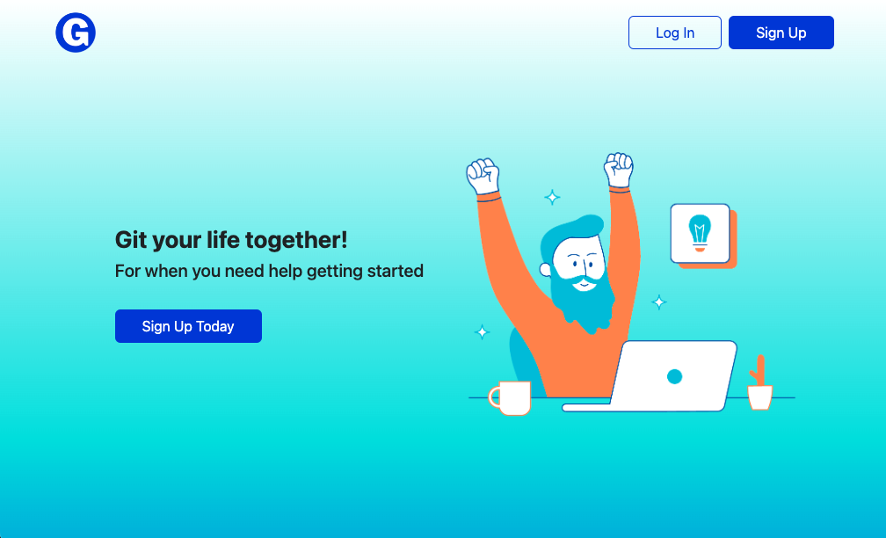
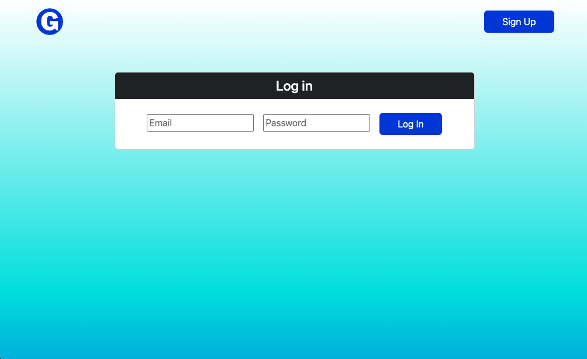
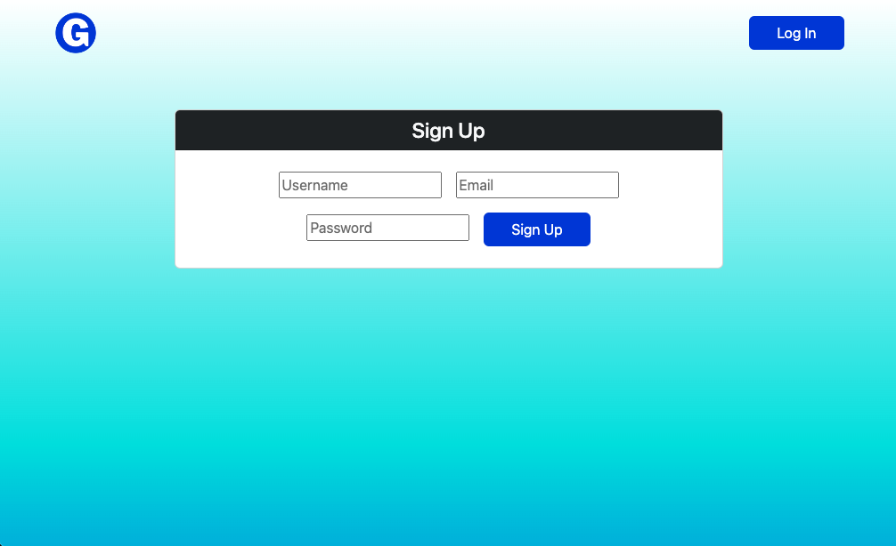
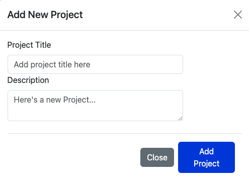
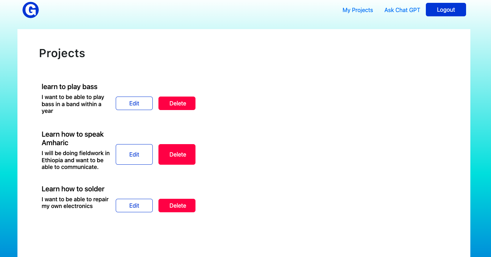
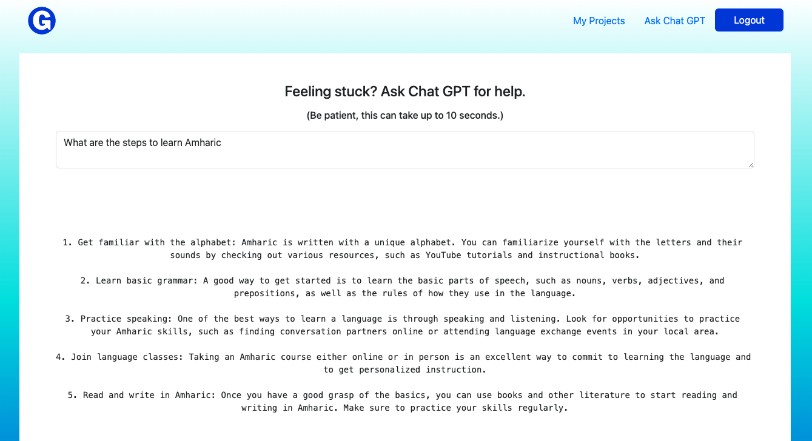
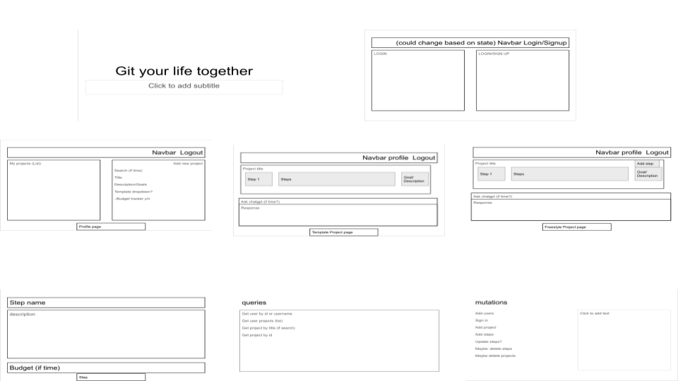
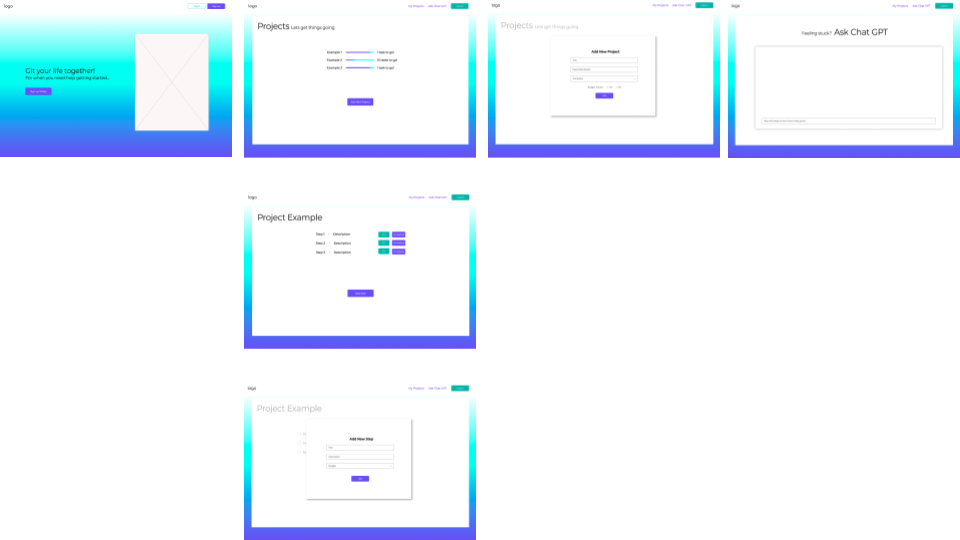
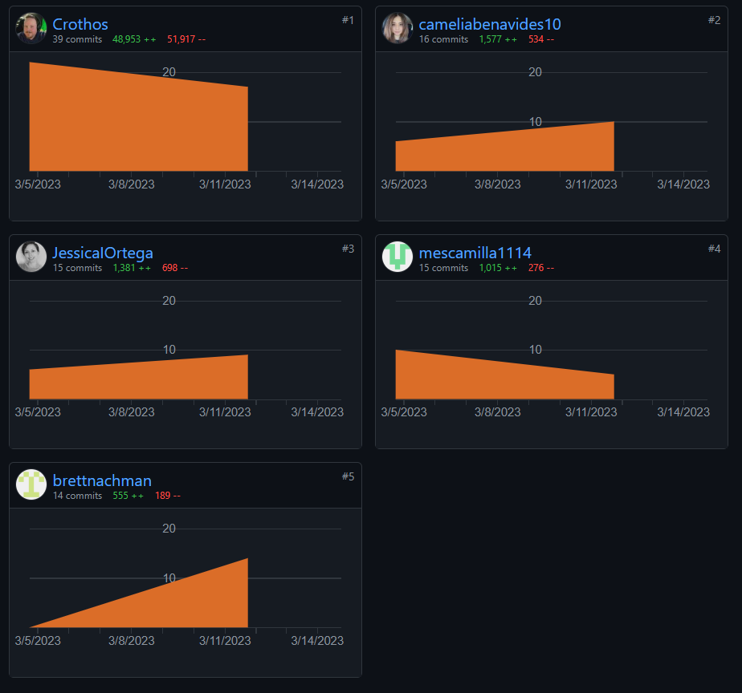

# Git Your Life Together

## Description

Git Your Life Together is an app that allows the user to reach a goal by breaking the path to achieving that goal into manageable steps. Users can input however many steps they determine are necessary and can interact with those steps in a number of ways (e.g., rearrange order, mark as in progress, mark as completed). If a user is unsure what steps are needed to reach a goal, they can input their query into ChatGPT, which will generate a list of steps that are required. From there, users can cut and paste the steps they wish to include and edit them as needed to implement thier own plan of action. Users can save and edit their personal goal pathways. 

    

## Table of Contents

- [Getting Started](#getting-started)
- [Screenshots](#screenshots)
- [Early Development](#early-development)
- [Built Using](#built-using)
- [Authors](#authors)
- [Saved for Later](#saved-for-later)
- [Acknowledgments](#acknowledgments)
- [License](#license)

 

## Getting Started

These instructions will get you a copy of the project up and running on your local machine for development and testing purposes.

1. Within GitHub, navigate to the main page of the repository.

2. Click the Clone or download button.

3. Copy the clone URL for the repository.

4. Open Terminal or CMD Prompt(Windows).

5. Change your current working directory to the location where you'd like the cloned directory be stored.

6. Type git clone, and then paste the URL you copied in Step 3.

          git clone https://github.com/JessicaIOrtega/Git-your-life-together-.git

7. Press Enter and a new local cloned repository will be created.   
    
   

## Screenshots

### Home page

### Navigation Bar

### Login Page

### Sign Up Page

### New Project Page

### Saved Projects Page

### ChatGPT Page with Response

### ChatGPT Page with Follow Up

       

## Early Development

### Initial Wireframe/Napkin Sketch

### Figma Wireframe

### First Repository (now defunct) Contributions

 
    

## Built Using
GitHub - https://github.com/

Openai API - https://openai.com/blog/openai-api

Axios - https://axios-http.com/docs/intro

Bootstrap - https://getbootstrap.com/

Express - https://expressjs.com/

React - https://reactjs.org/

MongoDB - https://www.mongodb.com/

Node.js - https://nodejs.org/

     

## Authors
  
Camelia Benavides - [GitHub](https://github.com/cameliabenavides10)

Michael Escamilla - [GitHub](https://github.com/mescamilla1114)

Brett Nachman - [GitHub](https://github.com/brettnachman)

Jessica Ortega - [GitHub](https://github.com/JessicaIOrtega)
  
Stephen Totten - [GitHub](https://github.com/Crothos)
  
      

## Saved for Later

Default templates to get users started

Refine formatting of returned chatGPT responses.

Allow users to search the database to see if others have already mapped out similar goals to use as inspiration.

Allow users to connect with one another to share successes and insights

      

## Acknowledgments

Ian Darland

Diem Ly

Negin Namiranian

Leah Nelson

Canva - https://www.canva.com/

Figma - https://www.figma.com

 

## License

Please see LICENSE file.

